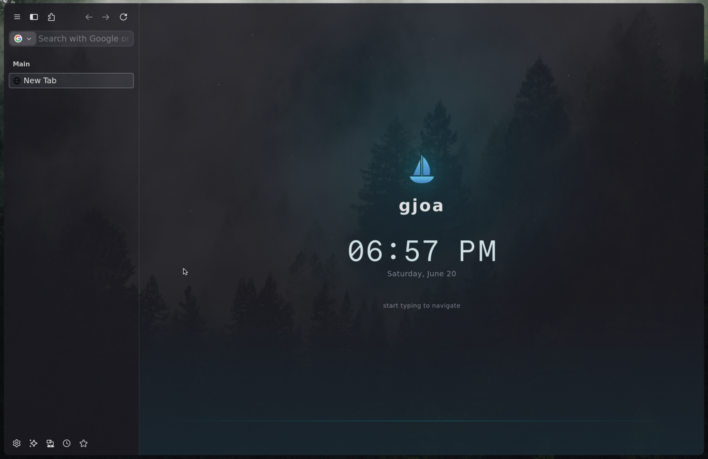

<div align="center">


# gjoa

**gjoa is a Firefox fork where the power-user extension stack is native.** Ad/tracker blocking, forced dark mode, vertical/tree tabs, workspaces, vim navigation, session history, and egress auditing live in the browser chrome and engine — not in extensions, content scripts, or autoconfig hacks.



</div>

## What it is

A Firefox fork, built on Firefox 152, where the things power users normally bolt on are first-class instead. The native power-user stack ships in the browser itself — no extension tax to pay on every page.

Removing that tax is the point. There's no content-script ad blocker firing per request, no Dark Reader repaint loop, no per-page injection path, and no autoconfig loader to keep alive. The work that an extension stack does at runtime, gjoa does in the chrome and engine — or doesn't do at all.

## Why native?

Most "power-user Firefox" is a tower of extensions: uBlock Origin, Dark Reader, Tree Style Tab or Sidebery, a Vimium-style nav layer, a session manager, and a pile of `about:config` surgery underneath. Every one of those is a moving part outside the browser's own lifecycle — content scripts, extra process boundaries, repaint hacks, an injection path on every navigation.

gjoa makes those capabilities browser features. Fewer per-page injections, fewer process boundaries, fewer repaint hacks, fewer parts to keep alive outside the browser. The capability is the same; the runtime cost and the surface area are not.

## Features

Each is a capability in today's build — the table is the at-a-glance index. The three notes below go deeper on the few where the *how* is the differentiator; the rest are well covered by the table. Source for every subsystem is one directory under [`src/gjoa/chrome/bjs/`](src/gjoa/chrome/bjs/) (chrome) or [`src/gjoa/toolkit/`](src/gjoa/toolkit/) + [`patches/`](patches/) (engine).

| Feature | Native mechanism | Source |
|---|---|---|
| Ad / tracker blocking | FF152's in-tree `adblock-rust` driven as a full content blocker — network, cosmetic, scriptlet | [`blocking/`](src/gjoa/chrome/bjs/blocking/), [`content-classifier/`](src/gjoa/toolkit/components/content-classifier/) |
| Dark mode | Gecko-native pre-paint inversion + `prefers-color-scheme` override, respecting site themes | [`dark-mode/`](src/gjoa/chrome/bjs/dark-mode/), `patches/` |
| Tree-style tabs + vim keymap | Chrome bundle over `gBrowser`; tree state as per-tab metadata, modal vim layer | [`tabs/`](src/gjoa/chrome/bjs/tabs/) |
| Workspaces | Tabs partitioned into named spaces, survive session restore | [`spaces/`](src/gjoa/chrome/bjs/spaces/) |
| Sidebar drawer + floating urlbar | Drawer chrome over the tab sidebar | [`drawer/`](src/gjoa/chrome/bjs/drawer/) |
| Session history | Append-only SQLite log + FTS5 full-text index | [`tabs/history.bjs`](src/gjoa/chrome/bjs/tabs/history.bjs), `patches/0007` |
| Custom new-tab / home | Forced-dark navigator page via a redirector | [`newtab/`](src/gjoa/browser/components/gjoa/content/newtab/), `patches/0011` |

- **Blocking is native, not an extension.** FF152 ships Brave's `adblock-rust` in-tree but only for tracker *annotation*; gjoa drives it as a full content blocker across three layers — **network** (requests killed before they leave the browser), **cosmetic** (element-hiding as a single `USER_SHEET`), and **scriptlets** (sandboxed, curated-only; list-driven `+js()` stays off). The filter lists are a default pref (`list_names` in [`adblock-prefs.bjs`](src/gjoa/defaults/pref/adblock-prefs.bjs)), not baked into prose. Chrome half in [`blocking/`](src/gjoa/chrome/bjs/blocking/); engine half in [`content-classifier/`](src/gjoa/toolkit/components/content-classifier/) + `patches/0008`.

- **Dark mode respects the site.** Pages with native dark CSS keep it; themeless pages are darkened by the engine *pre-paint* (no white flash), with a curated registry + per-site overrides for the rest. The levers are Gecko-native — a `prefers-color-scheme` override and an engine luminance-inversion flag read by `nsPresContext`, with a chrome-CSS fallback — so there's no content-script darkening on the core path. — [`dark-mode/`](src/gjoa/chrome/bjs/dark-mode/) + the `dark-mode-*` patches.

- **The keyboard surface.** The tab tree is modal-vim-driven (motion, indent/swap, leader chords, `/` filter, `:` ex-commands with picker + help) and fully remappable in **`about:vim`** or via qutebrowser-style `:bind`. Tabs partition into named **workspaces** that survive session restore (and follow the niri compositor's OS workspaces, one-way); workspace changes auto-save to a searchable **history** — `:checkpoint` / `:history` / `:restore`, an append-only SQLite log (WAL) + FTS5 index over URLs and titles. — [`tabs/`](src/gjoa/chrome/bjs/tabs/), [`spaces/`](src/gjoa/chrome/bjs/spaces/).

## Sovereignty and control

These share one philosophy: you can see what the browser does, you can turn it off, and nothing rots silently behind your back.

- **`about:gjoa` — one settings home** — gjoa's settings live in a single branded page (content blocking, dark mode, curated privacy profiles, and a reversible-features dashboard), not scattered through `about:config`. The page is data-driven from a registry, kept in sync with the loader's presets by a preflight gate. Firefox Settings carries a pointer to it — with zero patching of Firefox's preferences code. Registry: [`src/gjoa/browser/components/gjoa/content/settings/registry.json`](src/gjoa/browser/components/gjoa/content/settings/registry.json).

- **`about:sovereignty` — egress audit** — a source-derived list of every point the build contacts the network without user action, generated by a static AST audit of all authored chrome and tied to the running build's commit + patch hash (the page flags a mismatch rather than implying a match it can't prove). Regenerate with `bun run sovereignty:egress`. — tool in [`tools/sovereignty/`](tools/sovereignty/), page in [`src/gjoa/browser/components/gjoa/content/sovereignty/`](src/gjoa/browser/components/gjoa/content/sovereignty/).

- **Reversible by design** — every feature gjoa disables stays *present* and flippable — capabilities are parked behind a knob, never deleted. The reversible set, and the honest cost of re-enabling each (the network endpoint it re-contacts, not an invented perf number), is the reversible-features section of the settings registry.

- **Security freshness gate** — gjoa refuses to keep running a dangerously stale build: it probes Mozilla's published `firefox_versions.json` on startup + hourly; a full major behind latest stable quits, a point-release behind warns. Fails open offline; an env override exists for one-off emergencies. — [`security/`](src/gjoa/chrome/bjs/security/).

## Performance

gjoa's performance thesis is not "Firefox but compiled harder" — it's Firefox with the extension work removed from the page path. Native dark mode and native blocking do for free what Dark Reader and a content-script blocker do at real per-page cost.

The honest framing: the release build is `-O3` + full LTO + `-march=native`, but stock Firefox already ships PGO+LTO, so the gjoa-vs-stock delta from compiler flags alone is modest. The real win is the absent extension tax. Against the Firefox-plus-extensions setup people actually run, gjoa is dramatically lighter. Benchmark harnesses live in [`tools/bench/`](tools/bench/) (`bun run bench`); run them on your own hardware rather than trusting a number copied into a README.

## Status and source of truth

This README is the stable shape — durable claims about what the software does, with pointers to the living source of truth for anything the code keeps changing. Volatile detail (exact feature state, build outcomes, versions) lives in [`docs/ARCHITECTURE.md`](docs/ARCHITECTURE.md), [`gjoa.json`](gjoa.json), and the [releases](../../releases).

## Getting gjoa

```sh
bun run init                    # download mozilla-central + apply overlays
nix build .#gjoa --impure       # personal build — LTO + -march=native (THIS CPU only)
nix build .#gjoa-quickbuild --impure  # quickbuild — fast, no LTO, CPU-portable
./result/bin/gjoa
```

- **Release builds** — the quickest way to try gjoa without compiling. [`.github/workflows/`](.github/workflows/) builds portable artifacts per platform (Linux + macOS + Windows) on every tag, none `-march=native`. These are the builds to hand out.
- **Personal native build → `.#gjoa`.** Compiled `-march=native` for the CPU it's built on — fastest, but it can crash (SIGILL) on hardware that lacks those instructions, so it's a *local* build, not for arbitrary machines.
- **Portable / quickbuild → `.#gjoa-quickbuild`.** Fast, no LTO, CPU-portable; or `nix bundle .#gjoa-quickbuild --impure` for a single relocatable Linux executable that runs on any glibc distro with no Nix on the target.

The build variants and their exact flags are defined in [`flake.nix`](flake.nix); CI clones the **pinned** [Beagle](https://github.com/Autonymy/beagle) compiler — the SHA in [`configs/beagle.ref`](configs/beagle.ref) — as a sibling checkout, so every build is deterministic against a frozen compiler instead of a moving `HEAD`.

## Development

Source-tree changes (`.sys.mjs`, branding, configure flags) need a build, but chrome JS/CSS iterates in ~1s without one:

```sh
nix develop .#mach          # shell with mach + toolchain
cd engine && ./mach build   # one-time, ~30-60 min cold
# edit src/gjoa/chrome/bjs/*.bjs (or chrome/css/*.css) ...
gjoa sync                   # compile + deploy the .bjs chrome into the mach install (~1s)
gjoa hotreload              # restart the binary
```

Cheatsheet: [`docs/daily-loop.md`](docs/daily-loop.md) · full map + rebuild ladder: [`docs/ARCHITECTURE.md`](docs/ARCHITECTURE.md).

```sh
bun test                  # unit tests (happy-dom)
bun run test:integration  # headless Marionette tests against a gjoa binary
bun run preflight         # pre-build gates (patches, chrome alignment, beagle pin, nix eval)
```

`bun run preflight` runs the lettered gate set that catches patch / jar / eval / surface-contract breakage before a multi-hour compile; the gates and their jurisdiction are the **generated** registry in [`docs/stewardship/topology.md`](docs/stewardship/topology.md) (a preflight gate itself fails on any docs↔code drift), implemented in `tools/scripts/preflight.bjs`. `package.json` scripts are the live index of every subsystem-scoped test target (`test:adblock`, `test:darkmode`, `test:tabs`, …).

```
gjoa.json            project config — version of record, branding, URLs
flake.nix            Nix build (dev + release variants)
src/gjoa/            source overlays — chrome UI (.bjs/.css), engine actors, prefs, branding, loader
patches/             surgical patches against stock Firefox source (the engine half)
tools/               Firefox-source prep, release tooling, test harness, audits (Beagle on Bun)
.github/workflows/   cross-platform CI (Linux + macOS + Windows builds)
configs/            branding assets + pinned source/compiler refs
docs/               deep-dive documentation
```

## Why Beagle?

gjoa is written in [Beagle](https://github.com/Autonymy/beagle) (a typed Clojure subset) compiled to chrome JS and a native loader baked into `omni.ja`. Authoring in Beagle is a deliberate edge, not an aesthetic one: compile-time macros, **one** typed language across chrome / loader / tooling / tests / prefs, machine-checked effect discipline (a `BEAGLE_PURITY=error` check a TypeScript type system can't express), engine patches anchored by *declared structural dependencies* (a preflight gate fails the build when an upstream refactor moves a symbol a patch relies on, instead of letting it silently rot), and gjoa's own source queryable as a **call graph** — `who-calls` / `blast-radius` / `leverage`, CI-checked against the compiler. The honest case, including what *isn't* a win, is in [`docs/why-beagle.md`](docs/why-beagle.md).

## License

[MPL-2.0](LICENSE) — same as Firefox.
