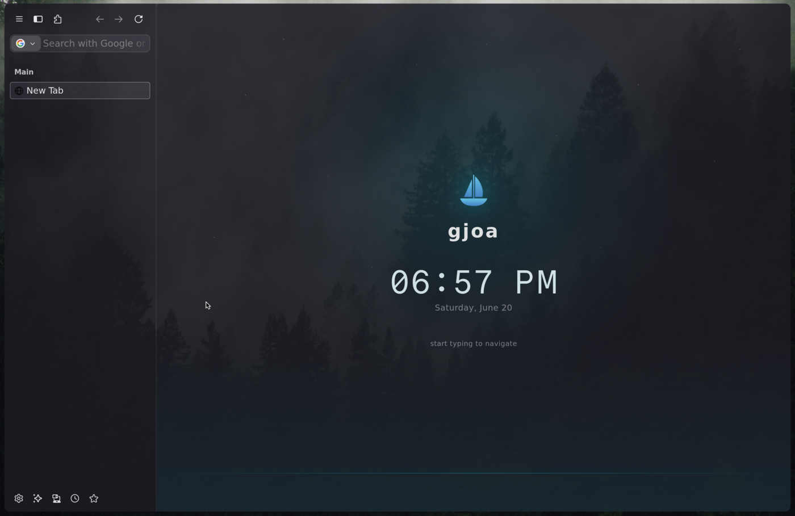

<div align="center">


# gjoa

**A Firefox fork with the power-user stack built in.**

Native blocking, site-aware dark mode, vertical tree tabs, workspaces, vim navigation, session history, and egress auditing live in the browser—not in an extension collection.



</div>

## Why gjoa

Most heavily customized Firefox setups depend on a stack of extensions, content scripts, and autoconfig workarounds. gjoa makes the core pieces browser features instead: fewer per-page injections, fewer separate lifecycles, and less to keep in sync after Firefox updates.

## Included

| Capability | What it does |
|---|---|
| Blocking | Native network, cosmetic, and curated scriptlet filtering |
| Dark mode | Pre-paint darkening for light sites while preserving native dark themes |
| Tabs + keyboard | Vertical tree tabs, modal navigation, remappable bindings, and commands |
| Workspaces | Named tab spaces that persist across session restore |
| History | Searchable, append-only session history |
| Browser UI | Floating urlbar, sidebar drawer, and a custom new-tab page |
| Control | `about:gjoa` settings, reversible features, and `about:sovereignty` egress audit |

## Releases

Tagged releases produce draft GitHub releases with portable artifacts for:

- Linux x86_64 (`.tar.xz`)
- macOS Apple Silicon (`.dmg`)
- Windows x86_64 (`.zip`)

Download the artifact for your platform from [Releases](../../releases), extract or mount it, then launch `gjoa`. Release artifacts are portable builds; they do not use `-march=native`.

## Build from source

```sh
bun run init
nix build .#gjoa-quickbuild --impure
./result/bin/gjoa
```

`gjoa-quickbuild` is the practical local build: CPU-portable and without LTO. `.#gjoa` is a personal, CPU-specific build with LTO and `-march=native`; do not distribute it to arbitrary machines.

## Development

Chrome JS and CSS iterate without a full Firefox rebuild:

```sh
nix develop .#mach
cd engine && ./mach build
# edit source...
gjoa sync
gjoa hotreload
```

Before a full build, run the focused checks:

```sh
bun run preflight
bun test
bun run test:integration
```

## Documentation

- [Architecture and build map](docs/ARCHITECTURE.md)
- [Daily development loop](docs/daily-loop.md)
- [Feature and verification topology](docs/stewardship/topology.md)
- [Why Beagle](docs/why-beagle.md)

The compiler, patching strategy, and other implementation detail live in those docs rather than in this release-facing page.

## License

[MPL-2.0](LICENSE), the same license as Firefox.
