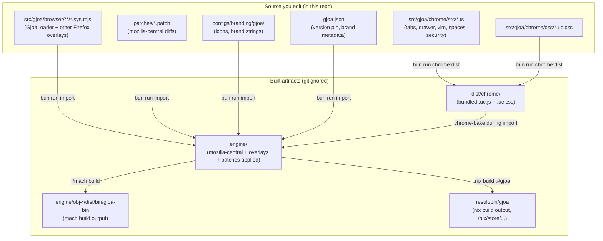
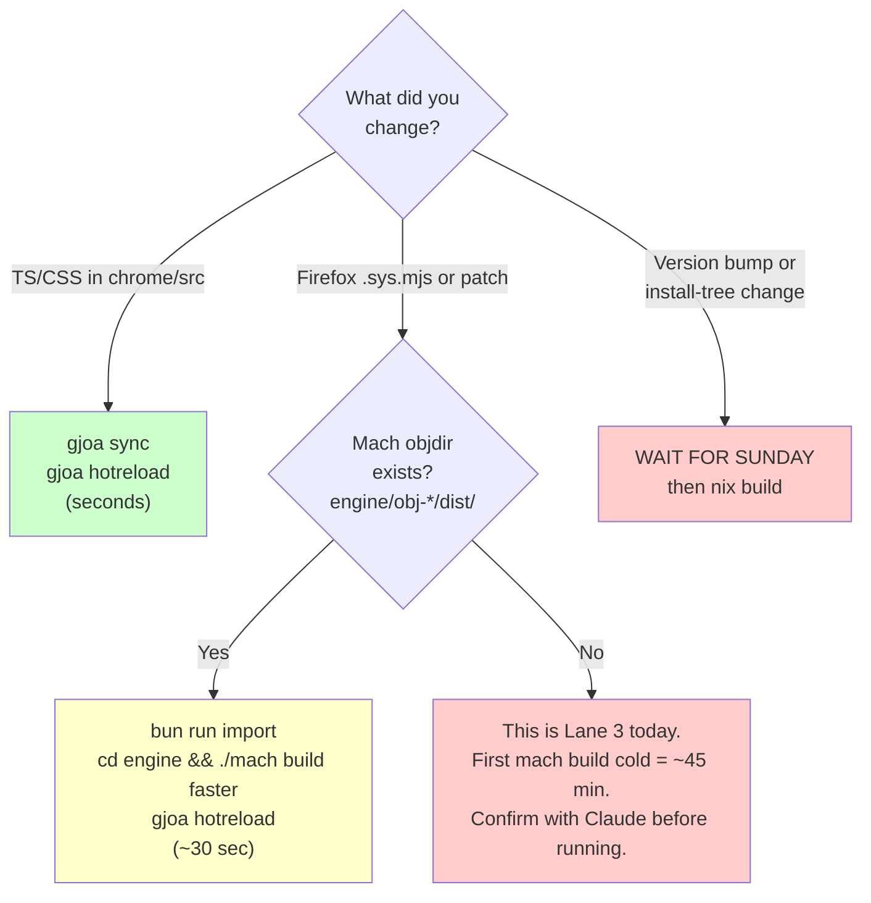
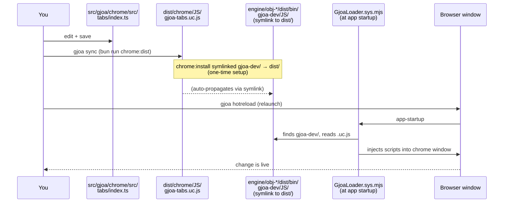
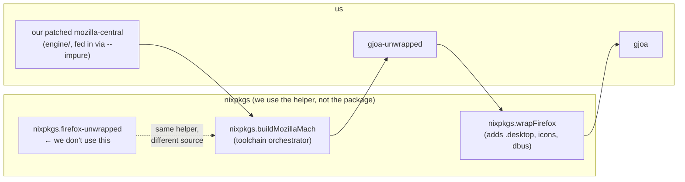

# gjoa architecture map

**Read this first when you come back to the repo.** The whole project on
one page. Diagrams render in any markdown viewer with mermaid support
(GitHub, VS Code preview, most others).

You should not need to remember rebuild discipline or compile flags.
That's Claude's job. This doc is for *understanding*, not memorization.
If you need to take action, run `gjoa status` — it tells you what command
to run for your current state.

---

## What gjoa is

A Firefox fork. We add UI behavior on top of stock Firefox by two
mechanisms:

1. **Chrome bundles** — TypeScript modules that load into Firefox's
   privileged chrome window at startup. This is where 99% of gjoa's
   custom behavior lives (tab tree, vim keymap, command palette,
   sidebar drawer).
2. **Source-tree patches/overlays** — when chrome bundles can't reach
   (changing a default pref baked into omni.ja, modifying Firefox's
   own components, patching mozilla-central C++), we modify Firefox's
   source.

Mechanism (1) iterates in seconds. Mechanism (2) costs a rebuild.
**Default everything to (1)** until it provably can't reach.

---

## The source map

**Read this as:** the things in the top boxes are what YOU edit. The
arrows are the build steps that transform them into runnable binaries.

---

## The rebuild ladder — what each edit costs

This is the answer to "do I need to rebuild?" Find your edit type in
the left column. The cost column is what it'll take to see your change
in the running browser.

| Edit type | What runs | Cost | Lane |
|---|---|---|---|
| `src/gjoa/chrome/src/**/*.ts` (TypeScript modules) | `gjoa sync` + restart browser | **~1 sec** | 1 |
| `src/gjoa/chrome/css/*.uc.css` | `gjoa sync` + restart browser | **~1 sec** | 1 |
| `src/gjoa/browser/**/*.sys.mjs` (Firefox `.sys.mjs` overlays) | `bun run import` + `./mach build faster` | **~30 sec** | 2 |
| `patches/*.patch` (new or edited) | `bun run import` + `./mach build faster` | **~30 sec** | 2 |
| `configs/branding/` text strings | `bun run import` + `./mach build faster` | **~30 sec** | 2 |
| `gjoa.json` version pin | `bun run import` + full mach or nix build | **30–60 min** | 3 |
| C++/Rust source under `engine/` (via patches) | `./mach build` (incremental) | **minutes** | 2/3 |
| Configure flags / mozconfig | `./mach configure && ./mach build` | **30–60 min** | 3 |
| Install-tree icons (PNGs baked into install root) | Full nix build | **30–60 min** | 3 |
| `flake.nix` toolchain inputs | Full nix build | **30–60 min** | 3 |

**Lane 1** = no rebuild, sub-second.
**Lane 2** = re-zip omni.ja, sub-minute.
**Lane 3** = full compile, half-hour to hour.

You almost never need Lane 3 mid-week. Lane 3 is a Sunday batch.

---

## The decision tree — "what should I run?"

When in doubt, run `gjoa status` — it walks this tree for you. But
here's the tree for understanding.

---

## How a chrome edit reaches the running browser

The path for the most common type of edit (Lane 1):

For nix builds (production mode), the path is similar but `.uc.js`
files live inside `omni.ja` as `chrome://gjoa/content/scripts/*` instead
of in the writable `gjoa-dev/` overlay.

---

## The Sunday rule (Rule #0 of CLAUDE.md)

**One nix or full mach build per week. Sunday.**

Any unexpected rebuild outside this window is a failure event. If you
hit one, it goes in `private-docs/build-logs/` with a postmortem describing
which preflight check should have caught it.

You don't need to remember the preflight. Claude runs it when proposing
a rebuild and shows you the result. **Your job is to look at the
proposal and say go or wait.** You should never be debugging which
flag to use.

---

## Are we using nixpkgs's Firefox?

**No.** This is the most common confusion. The clear answer:

- `nixpkgs` ships its own `firefox-unwrapped` (and `firefox` wrapper).
  That's *their* build of Mozilla source, using *their* version pin
  (currently 151.0).
- **We do not consume that.** We feed our own customized
  mozilla-central tarball (pinned in `gjoa.json`) through
  `nixpkgs.buildMozillaMach`, which is a 750-line helper that knows
  how to compile any Firefox source with the right toolchain (clang,
  rust, sccache, mold, etc.).
- The output is `gjoa-unwrapped` → `gjoa` (via `pkgs.wrapFirefox`).
  Parallel to nixpkgs's firefox, never derived from it.

What we DO depend on from nixpkgs:
- The build toolchain (clang 19, rust, sccache, mold) via the
  `nix develop .#mach` shell.
- The shared system libraries (gtk3, mesa, libpulseaudio, etc.) that
  Firefox links against.
- `buildMozillaMach` and `wrapFirefox` as helper functions.

What we do NOT consume from nixpkgs:
- nixpkgs's Mozilla source pin (they ship 151.0; we ship 151.0.1).
- nixpkgs's Firefox patches (we have our own `patches/`).
- nixpkgs's branding (we override with `configs/branding/gjoa/`).

`gjoa status` shows the nixpkgs Firefox version alongside ours so you
can see when they diverge.

## Glossary (the words that show up in errors)

| Term | What it actually is |
|---|---|
| `omni.ja` | The zip file inside Firefox holding all chrome JS/CSS/XHTML. Re-zipped by `mach build faster`. |
| `mach` | Mozilla's build orchestrator. Lives at `engine/mach`. Like `make` but Firefox-specific. |
| `engine/` | The mozilla-central source tree on disk, with our overlays + patches applied. Gitignored. 5 GB. |
| `objdir` | Mach's build output directory: `engine/obj-x86_64-pc-linux-gnu/`. Holds compiled C++/Rust + the final `gjoa-bin`. |
| `chrome bundle` / `.uc.js` | A TypeScript file compiled to a UserScript-style `.uc.js` that the GjoaLoader loads into Firefox's privileged chrome window at startup. |
| `gjoa-dev/` | A subdirectory next to the mach binary holding dev-mode chrome bundles. Symlinked to `dist/chrome/` by `gjoa sync`. |
| `chrome://gjoa/content/` | The "production mode" path — bundles baked into omni.ja, loaded via this URL scheme. |
| `Lane 1 / 2 / 3` | Our taxonomy of rebuild cost. Lane 1 = no rebuild. Lane 2 = `mach build faster`. Lane 3 = full build. |
| nix build | Full hermetic build via the flake. Distribution-grade, slow. Sunday only. |
| `nix develop .#mach` | Drops into a shell with Firefox's full build toolchain so you can run `mach` directly. |

---

## Where to look when something is wrong

| Symptom | Look at |
|---|---|
| "no sidebar in nix binary" | `result/bin/gjoa`'s omni.ja chrome.manifest. Should contain `content gjoa browser/content/gjoa/`. |
| "chrome JS edit doesn't take effect" | Did you run `gjoa sync`? Did you relaunch with `gjoa hotreload` (mach binary), not `gjoa` (nix)? |
| "patch failed to apply during import" | `patches/<N>-name.patch` line context drifted vs current Firefox version. Regen with `git diff` from inside `engine/`. |
| "build takes forever" | Probably running `nix build` for a Lane 1/2 change. Run `gjoa status` to confirm what you actually need. |
| "the launcher won't run" | `gjoa` requires a nix `result/bin/gjoa`. `gjoa hotreload` requires a mach `engine/obj-*/dist/bin/gjoa`. Build whichever's missing. |

---

## Pointers

- [`CLAUDE.md`](../CLAUDE.md) — operational rules, Rule #0 (Sunday rebuild budget)
- `private-docs/build-logs/` (private) — every build's date + outcome + postmortem
- [`docs/build-and-dev-loop.md`](build-and-dev-loop.md) — long-form reference (file types, mach command details, troubleshooting)
- [`docs/nix-dev-options.md`](nix-dev-options.md) — comparison of nix-dev paths, impurity tradeoffs
- [`docs/dev-loader.md`](dev-loader.md) — chrome loader architecture
- [`docs/security-policy.md`](security-policy.md) — Firefox version pin update cadence
