# gjoa Dark Mode

The single reference for gjoa's dark mode. **Part A** is the as-built architecture and
control flow of the shipped engine (how a page is decided, BOOT → PAGE-LOAD) — read it to
understand or debug current behavior. **Part B** is the v2 design theory (the
Legibility-Channel Frame Shift) and its build roadmap — read it for *why* the design is
what it is and where it is going. The section just below is the user-facing control
surface: the modes and the escape-hatch hierarchy.

---

## Modes & the escape-hatch hierarchy (how to override dark mode on a site)

Dark mode is a **layered decision pipeline where the narrowest scope wins**: a global
default you can shift, then progressively narrower overrides for the sites the general
path gets wrong. The layers compose — each one overrides the layer before it — so you
reach for the *narrowest* hatch that fixes your problem and leave everything else on the
smart default. From broadest to narrowest:

1. **Global mode** — `about:gjoa` → Dark mode section → **Mode**
   (pref `gjoa.darkmode.mode`). The top-level switch for *how* pages get dark:
   - **`dark`** (DEFAULT) — always dark, regardless of OS. Native-dark sites keep their
     own theme (no flash, via the pre-paint themeless test); themeless pages are
     engine-inverted into the Darkness band; the `GjoaDarkmode` actor refines per-site.
     **This is the only mode where the per-site `user.*` lists (layer 3) are live.**
     (The legacy about:config ids `hybrid`/`auto` fold into `dark`.)
   - **`uniform`** — force LIGHT, then luminance-invert *every* site to one controlled
     darkness (the legacy `engine` id folds here).
   - **`system`** — follow the OS theme. Dark OS → behaves like `dark` (native-dark sites
     keep their theme, the rest are engine-inverted); light OS → sites render as authored.
     The only mode whose outcome rides on a *spoofable* OS read (see "Where it can
     silently go light", Part A §6).
   - **`light`** — conventional Light appearance: force `prefers-color-scheme:light`, no
     inversion.
   - **`off`** — dark mode parked; the engine no-ops.
   - **`filter`** — legacy full-frame compositor invert; `about:config`-only, superseded
     by `uniform`.

2. **The "how dark" knobs** — still global, but tune the *output* rather than the
   strategy: **Darkness** (`gjoa.darkmode.invert.bgLightness`, the OKLCH-L floor inverted
   pages land on) and **Scrim strength** (`gjoa.darkmode.scrim.alpha`, the darkening over
   full-bleed background photos). Both in `about:gjoa`. Their advanced companions — the
   light-text ceiling `gjoa.darkmode.invert.fgLightness` and the APCA contrast floor
   `gjoa.darkmode.normalize.floor` — live in `about:config`.

3. **Per-site overrides** — `about:config` host lists (comma-separated), applied in `dark`
   (and `system` on a dark OS) by `GjoaDarkmodeParent`. Precedence within this layer:
   `off` > `force-invert` > `force-native`.
   - `gjoa.darkmode.user.force-native` — *keep the site's own look*; never invert it
     (use when inversion makes a site you like worse).
   - `gjoa.darkmode.user.force-invert` — *always invert this site*, even if it claims
     a dark theme (use when a site's "dark" theme is broken).
   - `gjoa.darkmode.user.off` — *no dark-mode treatment at all* for this site.

4. **The curated per-site fixes DB** — a built-in, shipped database of per-host CSS
   overrides and invert-selectors (`darkmode-fixes.json`, a Dark Reader MIT port). This is
   the pre-tuned escape hatch for sites the general path gets wrong, applied
   automatically; you don't configure it per-site, but it is the reason most tricky sites
   already look right without a manual `user.*` entry.

5. **The engine layers** — the lowest level, not user-facing knobs but the mechanism the
   above ride on: tier-0 native-dark detection (leave declared-dark sites alone), the
   style-resolution-time color inversion (cached in the cascade), the island scrim over
   photos, the role resolver, and the paint-time APCA text solve. A site is handled by
   whichever engine layers its mode + overrides select.

**Rule of thumb:** wrong globally → change **Mode** or **Darkness**; one site too
dark / not dark / double-inverted → a `user.force-native` / `force-invert` / `off`
entry for that host; a site the general path mangles → it is probably already in (or
belongs in) the curated fixes DB.

---

# Part A — As-built architecture & control flow

## 1. Orientation

gjoa's dark mode is a **layered decision pipeline where the narrowest scope wins**. From widest to narrowest: (a) the **master switch** `gjoa.darkmode.enabled` either parks everything or lets the engine live; (b) the **Appearance mode** `gjoa.darkmode.mode` (`dark`/`uniform`/`system`/`light`/`off`) is the central lever — the chrome controller's `apply!` translates it into a fixed tuple of native + engine prefs; (c) those **engine knobs** (`invert.enabled`, `hybrid.default-invert`, `content-override`, the OKLCH-L band `bgLightness`/`fgLightness`, the RFP color-scheme exemption) drive the compiled servo cascade (patches 0009/0014) that does the actual pre-paint pixel inversion; (d) **per-site host lists** (`user.off` > `user.force-invert` > `user.force-native`, live only in Dark) and (e) the **curated fix registry** (`darkmode-fixes.json`, 1786 hosts) refine individual documents via the `GjoaDarkmode` Parent/Child actor pair, which writes a per-document `colorInversionOverride` (`active`/`inactive`/`none`) that the engine reads **before** the global flag. A page is decided by the most specific layer that has an opinion; everything below is a default the layers above can override.

## 2. Lifecycle Flowchart

```mermaid
graph TD
  subgraph BOOT["BOOT — baked omni.ja"]
    BAKE["branding.bjs pref-append<br/>compiles dark-mode-prefs.bjs<br/>→ bakes 16 gjoa.darkmode.* defaults<br/>into firefox-branding.js"]
    BAKE --> PREFS["baked defaults:<br/>enabled=true mode=dark<br/>invert.enabled=false<br/>hybrid.default-invert=false<br/>bgLightness=16 fgLightness=92<br/>force=false scrim.alpha=140 ..."]
  end

  subgraph CHROMEINIT["CHROME INIT — index.bjs (Lane 1)"]
    INIT["init-!  (load)"]
    INIT --> SDD["set-darkmode-defaults!<br/>re-set DEFAULT branch from chrome:<br/>enabled=true, mode=dark<br/>(only these 2)"]
    SDD --> APPLY
    INIT --> OBS["register observers:<br/>PREF-ENABLED, PREF-MODE<br/>+ matchMedia change (mql)"]
    INIT --> API["expose window.gjoaDarkMode<br/>{toggle,cycleMode,isEnabled,getMode}"]
    OBS -->|enabled/mode pref change<br/>or OS theme flip| APPLY
  end

  APPLY{"apply!<br/>read enabled? + mode-"}
  APPLY -->|"not enabled OR mode=off"| OFF
  APPLY -->|mode=system| SYSQ{"system-dark?<br/>matchMedia prefers-color-scheme:dark"}
  APPLY -->|"mode=uniform / engine"| UNI
  APPLY -->|mode=filter| FILT
  APPLY -->|mode=light| LIGHT
  APPLY -->|"mode=dark / :else (auto,hybrid,unknown)"| DARK

  SYSQ -->|matches true| SYSD
  SYSQ -->|matches false| SYSL

  OFF["OFF arm<br/>chrome-scheme=false<br/>content-override=2 (none)<br/>invert=false default-invert=false<br/>rfp-exempt=false · remove-filter"]
  SYSD["SYSTEM/dark-OS (acts like Dark)<br/>chrome-scheme=true<br/>content-override=0 (dark)<br/>invert=false default-invert=true<br/>rfp-exempt=true · remove-filter"]
  SYSL["SYSTEM/light-OS (acts like Light)<br/>chrome-scheme=false<br/>content-override=1 (light)<br/>invert=false default-invert=false<br/>rfp-exempt=false · remove-filter"]
  UNI["UNIFORM/engine<br/>chrome-scheme=true<br/>content-override=1 (light)<br/>invert=TRUE default-invert=false<br/>rfp-exempt=false · remove-filter<br/>(force LIGHT then luminance-invert ALL)"]
  FILT["FILTER (legacy, about:config)<br/>chrome-scheme=true<br/>content-override=0 (dark)<br/>invert=false default-invert=false<br/>rfp-exempt=true · apply-filter! (CSS invert)"]
  LIGHT["LIGHT<br/>chrome-scheme=false<br/>content-override=1 (light)<br/>invert=false default-invert=false<br/>rfp-exempt=false · remove-filter"]
  DARK["DARK / :else (DEFAULT)<br/>chrome-scheme=true<br/>content-override=0 (dark)<br/>invert=false default-invert=TRUE<br/>rfp-exempt=true · remove-filter<br/>per-site lists live"]

  OFF --> NATIVE
  SYSD --> NATIVE
  SYSL --> NATIVE
  UNI --> NATIVE
  FILT --> NATIVE
  LIGHT --> NATIVE
  DARK --> NATIVE

  subgraph NATIVEPREFS["NATIVE PREFS written by apply!"]
    NATIVE["layout.css.prefers-color-scheme.content-override (0/1/2)<br/>gjoa.darkmode.invert.enabled<br/>gjoa.darkmode.hybrid.default-invert<br/>privacy.resistFingerprinting.overrides (RFP exemption)"]
    RFPNOTE["RFP master spoofs prefers-color-scheme:light<br/>→ exemption token +AllTargets,-CSSPrefersColorScheme<br/>only written if pref empty or our token"]
    NATIVE -.-> RFPNOTE
  end

  NATIVE --> ENGINE

  subgraph ENGINEPAINT["PRE-PAINT ENGINE — patches 0009 / 0014 (Lane 3, compiled)"]
    ENGINE["nsPresContext::UpdateColorInversion<br/>derives mColorInversion:<br/>chrome/image-doc → false<br/>else BC colorInversionOverride<br/> &gt; hybrid.default-invert<br/> &gt; gjoa.darkmode.invert.enabled"]
    ENGINE --> HYBRID["ApplyHybridDefaultInvertIfThemeless<br/>(PresShell::Initialize, post first cascade)<br/>Tier-0: themeless = !(usedDark && rendersDark)<br/>usedDark=ColorScheme==Dark, rendersDark=opaque(α≠0) AND lum&lt;0.22"]
    HYBRID --> CASCADE["Color::to_computed_color invert tail<br/>if device().color_inversion():<br/>invert_color_luminance per Absolute color<br/>OKLCH-L band white→floor(0.16) black→ceil(0.92)<br/>preserve_under_hero keeps light hero text"]
    CASCADE --> BGCOMP["DefaultBackgroundColor<br/>compress canvas backstop (no flash)"]
  end

  BGCOMP --> DOCSTART

  subgraph ACTOR["PER-SITE ACTOR — GjoaDarkmode (document-start → post-load)"]
    DOCSTART["Child.handleEvent · DOMWindowCreated<br/>top-doc, master gate enabled?"]
    DOCSTART -->|gjoa-UI host| UIOFF["colorInversionOverride='inactive'"]
    DOCSTART -->|force mode| FORCE["EVERY page 'active'<br/>(except off/force-native excludes)<br/>_explicitApplied=true"]
    DOCSTART -->|normal| SYNC["#syncExplicitOverride (sync, pre-layout,<br/>gated on hybrid.default-invert)<br/>fix-overrides mirror &gt; user off<br/>&gt; force-invert &gt; force-native"]
    SYNC --> AEXP["#applyExplicit (async)<br/>sendQuery Darkmode:GetInject"]
    AEXP --> PEXP["Parent.#explicit (null unless<br/>#hybridActive + parseable host)<br/>fix-registry HARD override<br/>(active/inactive, NOT auto)<br/>&gt; user off &gt; force-invert &gt; force-native"]
    PEXP -->|explicit| EXPAPPLY["frame 1: #runInject (MAIN-world scriptlet)<br/>+ #injectSheet (css)<br/>+ colorInversionOverride<br/>_explicitApplied=true"]
    PEXP -->|"override=none (auto/no-fix)"| DEFERRED["defer to post-load refiner"]
  end

  EXPAPPLY --> DCL
  DEFERRED --> DCL

  subgraph REFINE["POST-LOAD REFINER — DOMContentLoaded"]
    DCL["Child.handleEvent · DOMContentLoaded<br/>await _explicitPromise"]
    DCL -->|_explicitApplied| NORMONLY["normalize only (skip refiner)"]
    DCL -->|"not explicit, 2× rAF"| MEAS["#measureAndRefine<br/>compute hasNativeDark (#pageIsDark)<br/>sendQuery Darkmode:Decide {w,h,hasNativeDark}"]
    MEAS --> AUTO["Parent.#auto<br/>#paintedMedianLstar (drawSnapshot, median L*)<br/>painted LIGHT (≥LIGHT_LSTAR=50,<br/>or 20 with 'auto' fix) → 'active' (DARK)<br/>painted DARK → 'none' (defer to engine)"]
    AUTO --> CAPPLY["Child applies returned css + override"]
    CAPPLY -->|override='active'| DIM["#dimLargeMedia<br/>large bright hero → 'inv' or 'dim'"]
    CAPPLY --> NORM["#maybeNormalizeContrast (if normalize.enabled)<br/>→ Parent.#normalize APCA retone (floor=45)"]
    CAPPLY --> IMG["#maybeRunImagePass (if image-analysis.enabled<br/>AND engine inverting) — default OFF"]
    DIM --> SPA["SPA backstop: ONE 2500ms re-measure<br/>upgrades light→active only, never retracts"]
  end
```



## 3. Sequence — Single Page Load (youtube.com, Dark mode)

```mermaid
sequenceDiagram
  participant Ctl as Chrome controller<br/>(index.bjs apply!)
  participant Pref as Native prefs
  participant Eng as Engine<br/>(nsPresContext / servo)
  participant Par as GjoaDarkmodeParent
  participant Chi as GjoaDarkmodeChild
  participant Page as youtube.com doc

  Note over Ctl: startup — mode="dark"
  Ctl->>Pref: content-override=0 (dark)
  Ctl->>Pref: hybrid.default-invert=true
  Ctl->>Pref: invert.enabled=false
  Ctl->>Pref: rfp overrides=+AllTargets,-CSSPrefersColorScheme
  Note over Par: loadFixes() → mirrorOverridesPref<br/>(youtube override='auto' → NOT mirrored)

  Note over Page: navigation begins
  Eng->>Pref: UpdateColorInversion reads<br/>BC override(none) > hybrid.default-invert(true)
  Eng->>Eng: ApplyHybridDefaultInvertIfThemeless<br/>(Tier-0 themeless test, pre-paint)

  Page->>Chi: DOMWindowCreated (document-start)
  Chi->>Chi: master gate enabled? (true)
  Chi->>Chi: #syncExplicitOverride (sync)<br/>fix-overrides pref has no hard youtube entry
  Chi->>Par: sendQuery Darkmode:GetInject
  Par->>Par: #explicit — youtube override='auto'<br/>falls through (no HARD override),<br/>but ships native css + inject scriptlet
  Par-->>Chi: {explicit, override, css, inject}<br/>(html[dark] scriptlet + #0f0f0f css are<br/>fix-REGISTRY data, not Child-authored)
  Chi->>Page: #runInject via Cu.Sandbox MAIN-world<br/>MutationObserver force-sets <html dark>
  Chi->>Page: #injectSheet css html,body{bg:#0f0f0f}
  Note over Page: YouTube's OWN dark theme activates<br/>(native, not engine-inverted)

  Page->>Chi: DOMContentLoaded
  Chi->>Chi: await _explicitPromise
  alt explicit applied (youtube native)
    Chi->>Chi: normalize-only (skip refiner)
  else auto/no-fix host
    Chi->>Chi: 2× rAF → #measureAndRefine
    Chi->>Par: Darkmode:Decide {w,h,hasNativeDark}
    Par->>Par: #auto → #paintedMedianLstar (drawSnapshot)
    Par-->>Chi: override ('active' if painted light, else 'none')
    Chi->>Page: set colorInversionOverride (+ #dimLargeMedia if active)
  end
  Note over Chi,Page: ONE 2500ms SPA re-measure (upgrade-only)
```

## 4. ASCII Lifecycle (terminal fallback)

```
BOOT (baked omni.ja)
  branding.bjs compiles dark-mode-prefs.bjs
    -> bakes 16 gjoa.darkmode.* defaults into firefox-branding.js
       enabled=true  mode=dark  invert.enabled=false  hybrid.default-invert=false
       bgLightness=16  fgLightness=92  force=false  scrim.alpha=140 ...
        |
        v
CHROME INIT  (index.bjs, Lane 1)
  init-!
    |-- set-darkmode-defaults!  (DEFAULT branch, chrome): enabled=true, mode=dark   [only these 2]
    |-- apply!                  (initial decision)
    |-- observers: PREF-ENABLED, PREF-MODE, matchMedia 'change'  --re-run--> apply!
    |-- window.gjoaDarkMode {toggle, cycleMode, isEnabled, getMode}
        |
        v
apply!  (read enabled? + mode-)   cond:
  +-------------------------------------------------------------------------------------------+
  | arm            | chrome-scheme | content-override | invert | default-invert | rfp | filter |
  |----------------|---------------|------------------|--------|----------------|-----|--------|
  | OFF / disabled | false         | 2 (none)         | false  | false          | off | remove |
  | SYSTEM dark-OS | true          | 0 (dark)         | false  | TRUE           | on  | remove |
  | SYSTEM light-OS| false         | 1 (light)        | false  | false          | off | remove |
  | UNIFORM/engine | true          | 1 (light)        | TRUE   | false          | off | remove |
  | FILTER (legacy)| true          | 0 (dark)         | false  | false          | on  | APPLY  |
  | LIGHT          | false         | 1 (light)        | false  | false          | off | remove |
  | DARK / :else   | true          | 0 (dark)         | false  | TRUE           | on  | remove |
  +-------------------------------------------------------------------------------------------+
   (SYSTEM arm first asks system-dark? = matchMedia prefers-color-scheme:dark)
        |
        v  writes native prefs
NATIVE PREFS
  layout.css.prefers-color-scheme.content-override  (0=dark 1=light 2=none)
  gjoa.darkmode.invert.enabled
  gjoa.darkmode.hybrid.default-invert
  privacy.resistFingerprinting.overrides  (exempt token, only if empty/own)
        |
        v
PRE-PAINT ENGINE  (patches 0009/0014, COMPILED — Lane 3)
  nsPresContext::UpdateColorInversion
    chrome/image-doc -> false
    else: BC colorInversionOverride  >  hybrid.default-invert  >  invert.enabled
  ApplyHybridDefaultInvertIfThemeless  (Tier-0: themeless = !(usedDark && rendersDark))
  Color::to_computed_color invert tail -> invert_color_luminance (OKLCH-L band)
    white -> floor(0.16)   black -> ceil(0.92)   preserve light hero text
  DefaultBackgroundColor compresses canvas backstop (no flash)
        |
        v
PER-SITE ACTOR  (GjoaDarkmode pair)
  Child.DOMWindowCreated (document-start, top-doc, enabled gate)
    gjoa-UI host         -> override='inactive'
    force mode           -> EVERY page 'active' (off/force-native excluded), _explicitApplied
    normal               -> #syncExplicitOverride (sync, pre-layout, gated on hybrid.default-invert)
                            -> #applyExplicit -> Parent.#explicit (null unless #hybridActive + host)
                               precedence: registry HARD (active/inactive, NOT auto)
                                           > user off > force-invert > force-native
                               explicit -> frame1: runInject + injectSheet + override
                               none     -> defer to post-load refiner
        |
        v
POST-LOAD REFINER  (Child.DOMContentLoaded, await _explicitPromise)
  _explicitApplied -> normalize only
  else 2x rAF -> #measureAndRefine
     -> Parent.#auto -> #paintedMedianLstar (drawSnapshot median L*)
          painted LIGHT (>=50, or 20 with 'auto' fix) -> 'active'  (force DARK)
          painted DARK                                 -> 'none'    (defer to engine)
     -> Child applies css + override
          override='active' -> #dimLargeMedia (hero: 'inv'/'dim')
          normalize.enabled -> #normalizeContrast (APCA floor 45)
          image-analysis.enabled AND inverting -> image pass (default OFF)
     -> ONE 2500ms SPA re-measure (upgrade light->active only, never retracts)
```

## 5. Light-vs-Dark Levers

| Lever (pref / fn / patch) | Value → DARK | Value → LIGHT | Layer | Baked / Synced |
|---|---|---|---|---|
| `gjoa.darkmode.enabled` (master) | `true` — engine live | `false` — off arm: content-override=2, no invert, actor no-ops | master switch | baked `true`; chrome-synced (DEFAULT branch) |
| `gjoa.darkmode.mode` (Appearance) | `dark` (default) / `uniform` / `system`+dark-OS | `light` / `off` / `system`+light-OS | mode selector | baked `dark`; chrome-synced |
| `layout.css.prefers-color-scheme.content-override` | `0` (force content dark) | `1` (force light); `2` = none | native, written by `apply!` | runtime (apply! per mode) |
| `gjoa.darkmode.invert.enabled` | `true` (luminance-invert ALL — uniform only) | `false` | engine flag (apply!-owned) | baked `false`; overwritten by apply! |
| `gjoa.darkmode.hybrid.default-invert` | `true` (pre-paint themeless dark, no flash — dark/system-dark) | `false` | engine flag (apply!-owned) | baked `false`; overwritten by apply! |
| `gjoa.darkmode.invert.bgLightness` (Darkness) | LOWER (16 → ~#0d0d0d; white maps here) | HIGHER (lighter bg) | engine band (data) | baked `16` (engine hardcodes fallback 20 → L0.20 if pref unset); NOT touched by apply! |
| `gjoa.darkmode.invert.fgLightness` (Text) | LOWER (dimmer text) | HIGHER (92 → ~#e4e4e4; black maps here) | engine band (data) | baked `92`; NOT touched by apply! |
| `gjoa.darkmode.force` | `true` — actor marks EVERY page `active` (forces scheme-declaring sites dark) | `false` — engine skips scheme-declaring sites | actor-side knob | baked `false`; about:config only (no apply! setter) |
| `gjoa.darkmode.user.off` (per host) | host absent | host present → `inactive` (highest user precedence) | per-site list (Dark only) | baked `""`; settings UI |
| `gjoa.darkmode.user.force-native` (per host) | host absent | host present → `inactive` (keep site look) | per-site list (Dark only) | baked `""`; settings UI |
| `gjoa.darkmode.user.force-invert` (per host) | host present → `active` (always invert) | host absent | per-site list (Dark only) | baked `""`; settings UI |
| `privacy.resistFingerprinting.overrides` | `+AllTargets,-CSSPrefersColorScheme` (scheme spoof off) | `""` / no exemption while RFP on | native (apply!-managed) | runtime; only if empty/own token |
| `privacy.resistFingerprinting` (master) | off, OR on+exemption | on without exemption (spoofs light) | native (worked-around) | librewolf profile; never written by gjoa |
| `colorInversionOverride` (per-doc BC) | `active` (force invert) | `inactive` (accept native); `none` defers | actor → engine | runtime per document |
| Fix-registry HARD override (`#explicit`) | `active` (curated force-invert) | `inactive` (ship curated dark css AS-IS, inversion OFF) | curated registry | `darkmode-fixes.json` (packaged) |
| Fix-registry `auto` entry | lowers `#auto` force bar to L*20 | yields to genuinely-dark site | curated registry | packaged (all 1786 are `auto`) |
| `#auto` painted-median-L* | painted ≥ threshold (50, or 20 w/ fix) → `active` | painted < threshold → `none` (defer) | post-load refiner | runtime measurement |
| `ApplyHybridDefaultInvertIfThemeless` Tier-0 | themeless (`!(usedDark && rendersDark)`) → invert | usedDark AND rendersDark (opaque α≠0 & lum<0.22) → keep native | engine patch 0014 | compiled (Lane 3) |
| `Color::to_computed_color` invert tail | reads `color_inversion()` true → compress every color | patch absent → cannot darken at all | engine patch 0009 | compiled (Lane 3) |
| `preserve_under_hero` (color.rs) | inherited dark text under image-backdrop → inverts light | inherited light text (lum>0.5) under backdrop → preserved | engine patch 0009 | compiled (Lane 3) |
| `set-chrome-scheme!` | `true` (dark/uniform/filter/system-dark) — chrome UI dark | `false` (off/light/system-light) | chrome DOM (no native pref) | runtime |
| `apply-filter!` vs `remove-filter!` | `apply-filter!` ONLY in legacy `filter` mode | `remove-filter!` everywhere else | chrome CSS (no native pref) | runtime |
| `system-dark?` (matchMedia, system mode) | matches `true` → Dark sub-arm | matches `false` (incl spoof false-read) → Light sub-arm | chrome read (spoofable) | runtime |

## 6. Where It Can Silently Go LIGHT

- **`system-dark?` false-read on a dark OS.** `system` mode resolves dark-vs-light from `window.matchMedia("(prefers-color-scheme: dark)")` on the chrome window — the only spoofable input to the decision. Under RFP, or when a wayland/niri portal Gecko can't read, this reports LIGHT on a genuinely dark OS, so the `system` arm silently renders every site light. This is exactly why the default was moved off `system` to `dark` (which never consults the OS); a stale `init-!` comment (lines 222–223) still claimed *"the default appearance is now 'system' (follow OS)"*, contradicting `set-darkmode-defaults!` and `mode-`, which both set/default to `dark` — fixed in this pass.
- **RFP color-scheme spoof with no exemption.** With the librewolf profile (`privacy.resistFingerprinting=true`), content `prefers-color-scheme` is spoofed LIGHT, defeating `content-override=0` so native-dark sites stay light. `set-rfp-colorscheme-exempt!` only writes the exemption token when `privacy.resistFingerprinting.overrides` is empty or already gjoa's token — so a user with their **own custom overrides string never gets the exemption**, and dark mode silently fails on native-dark sites.
- **Stale baked binary lacking the inversion patch.** The actual pixel inversion lives ONLY in patch 0009's `Color::to_computed_color` invert tail (and Tier-0 in 0014). A binary missing these patches **cannot darken any page** even though chrome flips `invert.enabled` / `colorInversionOverride` — the prefs and flags exist but nothing reads `color_inversion()` to mutate pixels. This is a compiled-engine (Lane 3) capability, not chrome-overridable.
- **Mode unset hitting a wrong default.** `mode-` falls back to `dark` and `set-darkmode-defaults!` re-sets the DEFAULT branch to `dark` — but only `enabled` and `mode` are chrome-synced; the other 14 prefs rely solely on the baked omni defaults. If the baked defaults are absent (e.g. branding pref-append skipped) and chrome hasn't seeded them, the engine/actor read prefs directly and can land on `false`/`0`, producing no darkening. The live default in `dark-mode-prefs.bjs`, `set-darkmode-defaults!`, and `apply!`'s `:else` must all agree on `dark` (flagged as a 3-way coupling hazard).
- **Curated dark theme wrongly inverted (flip-back-to-light).** Registry `inactive` entries ship their css AS-IS with inversion OFF because they ARE a dark theme; if such a site is instead force-inverted (e.g. via `force` mode or `user.force-invert`), the engine flips its dark bg back toward light — the HN/BBC regression. Conversely, an `auto` entry that ships DR-tuned css against gjoa's own engine inversion double-applies.
- **`migrate-mode!` is dead.** It is defined but its call is commented out of `init-!`, so the `migrated-v2` marker is never set and pre-cutover USER-branch `system` values are not rewritten — they hit the live `system` branch (now plain OS-follow), re-exposing the `system-dark?` false-read above.
- **Per-doc override semantics inverted.** `content-override` uses `0=dark, 1=light, 2=none` (lower = darker), and `colorInversionOverride='inactive'` means *accept native* (LIGHT if the page is light), not "off-as-in-dark". Misreading either flips a site to light.

---

# Part B — Dark Mode v2 (design theory + roadmap)

**Status:** Canonical plan. Supersedes `docs/darkmode-v2-plan.md` (commit 45fdc63),
which is absorbed below. Derived, not designed — every architectural decision is a
theorem of three postulates about the eye, not a choice. This document is structured
in the style of `fram/docs/WHY_FRAM_EXISTS.md`: a verdict, the atom, the forced
derivation, the architecture as theorems, the negative space, and a decision record
with falsification conditions.

**Revisit policy:** This theory may only be retired by *refuting it in its own terms*
(see the Decision Record). It may not be retired because a cheaper transform benchmarks
well on achromatic prose, nor because "inversion is simpler." Those are pre-answered.

---

## Verdict (one sentence)

The atom is **luminance-channel figure/ground discrimination at the dark-adapted eye** —
reading is one brightness wire resolving a glyph's edge against the surface *actually
behind it* — so dark mode is **forced** to be the maximal downward translation of the
luminance frame that still holds every figure/ground pair inside a glare-bounded band,
solving **surfaces-first-then-text**, holding the two identity (chroma) coordinates fixed;
every other piece (OKLab, APCA, the ~#121212 floor, the ~Lc 90 ceiling, never-touch-photo,
the tiers) is a theorem of that one anatomical fact plus the night cost, not a designer's
choice.

---

## Part I — The Theory

### The atom (the turtle at the bottom)

Reading is figure/ground discrimination performed by the eye's **one achromatic
(luminance) opponent channel** — the only channel with the spatial-acuity bandwidth to
resolve a glyph edge. So a screen color, *to a reader*, decomposes into **one legibility
coordinate** (luminance) orthogonal to **two identity coordinates** (chroma/hue). The
relation is irreducible because:

1. It is a property of an ordered **pair** — (glyph-region, the region actually behind
   it) — evaluated by a nonlinear sensor. A single color carries **zero** bits of
   readability. One hand cannot clap; a gray card has no readability until you say "on
   *what*?"
2. It is **signed** — which is figure, which is ground — because dark-on-light and
   light-on-dark are different perceptual regimes near black.

Beneath this is only human vision at the night operating point, which we do not get to
redesign. That is the turtle: **reading = the brightness wire discriminating a signed
edge across a pair.**

### The three postulates

- **P1 — THE EYE'S BASIS (reading lives on one wire).** Vision encodes a surface as one
  legibility coordinate (luminance) orthogonal to two identity coordinates (chroma/hue,
  which carry identity, not legibility). Reading is recovery of the *signed* luminance
  figure/ground relation across each (mark, real-ground) pair: conserve its sign and its
  perceptual magnitude. This fact alone forces *what may move* (luminance) and *what must
  be conserved* (the two chroma coordinates, and the sign).

- **P2 — THE NIGHT FRAME (darkness is the budget, not the goal).** At low ambient the eye
  adapts to a dark operating point where emitted light is costly (glare, melanopic load,
  energy) **and** discrimination is maximal only inside a two-sided **band**: a floor from
  the contrast-sensitivity function (too little = illegible) and a ceiling from
  glare/halation (too much on a dark-adapted surround scatters in the eye and *smears the
  very edge being read*). Absolute luminance is therefore a frame the operator is
  *obligated to translate downward* — as far as the band tolerates — never a target to
  maximize.

- **P3 — ROLE DIES AT RENDER (freeze before you solve).** Authored intent (which region
  is mark, which is ground, which is a photograph) is destroyed once rasterized to a flat
  pixel buffer. The transform is ill-posed unless evaluated where role still exists
  (layout/paint), and it must be **sequenced**: a contrast relation needs a fixed
  reference, so the ground must be resolved and *frozen* before any mark is solved against
  it. Photographs carry no authored figure/ground relation — they are signal to display,
  not structure to read — so they lie *outside the operator's domain by definition*.

### The forced derivation

**The pixel is the wrong atom — structurally** (the datom-vs-claim move). The quantity
reading consumes (P1) is a property of a *pair*, not locatable in either color alone nor
in any linear function of the pair. So **any per-color operator is blind to its own
success metric by construction** — its domain is single colors, so it literally cannot
read whether the mark is still discriminable from its ground. This is *exactly today's
bug*: patch 0009 inverts per-property at `Color::to_computed_color` (verified: Y→1−Y WCAG
involution, role-blind), so nothing checks the final mark against the final color behind
it, and MIT Press Reader goes dark-on-dark. The same fact forces the **layer**: in
WebRender's flat `ColorF` the pair and the role are gone, so the operator there is *not
slower — it is impossible*, because the operand (the pair) does not exist. The operator is
forced **up** to where role lives (layout / `nsTextFrame` paint, sampling the real
composited backdrop).

- **Hold-hue is a theorem, not an axiom.** Two routes agree: (a) act only on the
  legibility coordinate ⇒ the identity coordinates are untouched; (b) write the minimal
  transform as moving (L, C, h) and note hue *h* enters **no** contrast constraint
  (contrast is luminance) and **no** emission constraint (chroma/hue do not set the night
  budget). A variable absent from every constraint has its minimizer exactly at its
  original value ⇒ **Δh = 0 exactly.** `255−x` is rejected *by stationarity, not by taste*.

- **A perceptually-uniform, hue-separable space is required, not preferred** (OKLab/
  OKLCH/HCT). Acting in RGB shears identity while moving legibility (dark blue → purple) —
  the wrong basis, a different and wrong operator.

- **APCA is the forced instrument, not an axiom.** P2 forces requirement (ii): a contrast
  *metric* that is polarity-aware and honest near black, because the band's edges *live*
  near black. WCAG-2 overstates contrast near black — it would certify illegible
  dark-on-dark as passing. That polarity-aware near-black-honest shape *is* APCA's. Needing
  (ii) is the theorem; APCA is the instrument.

- **Hold chroma, never *add* it (Helmholtz–Kohlrausch) — a basis correction, not a
  softening.** By H-K the luminance channel reads saturated chroma as *added* brightness, so
  re-saturating a mark to push it lighter would re-inflate perceived luminance and drift it
  out of band. The forced consequence is the *one-sided* rule **never add chroma**: move only
  lightness and hold the original chroma, reducing it *only* where the (L, h) move lands
  outside sRGB gamut (a gamut clip, not a perceptual H-K compression). **This is what
  ships** — `colormath.js correct()` and patch 0013's `GjoaDarkText` carry `C0` unchanged and
  gamut-clip at fixed (L, h); see the verdict's "holding the two identity (chroma) coordinates
  fixed." A perceptual H-K *compression curve* that actively sheds chroma toward a measured
  band-luminance is a confessed-free, **unshipped** refinement (below, M4+) — forced in
  *direction* but not in magnitude, since the H-K effect is strongly hue-dependent.

- **Freeze-surfaces-then-solve-text is forced by convergence.** A joint fg+bg fixed point
  *oscillates* (darken the ground → mark too close; lighten the mark → too bright; round
  forever — a non-contraction, **verified**). A frozen-bg 1-D monotone root-find
  *converges*. P2 pins each surface independently (emission constrains the *ground*
  luminance alone), which is the only thing that breaks the fg/bg coupling. Sequencing is
  *existence-of-a-solution*, not preference. (This is also why a content-side corrective
  applied while the ground transform is still live gets re-inverted — verified: saga
  pre==post 16→16.)

- **The band's two edges, the floor, never-touch-photo, idempotence/tiers** all fall out
  of P1 ∩ P2 ∩ P3 (see Theorems).

### The operator

`RETONE` = a per-document, role-resolved, **sequenced** luminance frame-shift, evaluated
where role and the real backdrop both exist (layout / `nsTextFrame` paint, **not**
WebRender's flat `ColorF`), realized in a hue-separable perceptually-uniform space
(OKLab/OKLCH/HCT as instrument). The full operator below is the *target*; the milestone
ladder (Part II) marks what ships today. **Shipped (M0–M3):** the per-mark solve (step 3) —
`colormath.js correct()` ported to patch 0013's `GjoaDarkText`, run at `nsTextPaintStyle::
GetTextColor` against the effective backdrop, holding hue, holding chroma and gamut-clipping
only. **Not yet shipped:** the explicit surface ramp-freeze with a ~#121212 floor (step 2)
and the halation-ceiling-as-band-clamp (step 4 of the milestone ladder, M4) — today's
surfaces reach "dark" via patch 0009's *floorless* `Y→1−Y` luminance flip, not a floored
ramp.

0. **Identity gate.** If the document is declared-dark **and measures legible-in-band**
   under P2, return the zero transform (Tier 0). Else:
1. **Partition** by the role the layout resolver still knows — surface / mark
   (text, icon, border) / photo. Photographs, canvas, video, WebGL are **outside the
   domain**: never recolored.
2. **Freeze surfaces.** *(Target — M3/M4, not yet shipped; today's surfaces are flipped by
   patch 0009's floorless `Y→1−Y`.)* Map each surface's lightness *monotonically* (sign/order-
   preserving) onto a dark ramp floored at ~#121212 (never #000), holding hue, gamut-clipping
   chroma; **freeze** them.
3. **Solve marks** against the now-constant ground *(shipped — M3)*: per mark, a 1-D monotone
   APCA root-find on the *luminance* coordinate to land |Lc(mark, frozen-ground)| inside the
   band [floor ~Lc 45 (`correct()`'s default) … ceiling ~Lc 90], choosing the polarity that
   maximizes APCA against this backdrop, holding hue, **holding chroma** (and gamut-clipping
   only — never re-saturating: the H-K "never add" rule). *This is gjoa's proven `colormath.js
   correct(fg, bg, T, ceiling)`* (ported to `GjoaDarkText`) — polarity-pick + binary-search
   the minimal hue-preserving lightness shift that clears the floor (+3 hysteresis), with a
   ceiling backstop.
4. **Scrim** over role=photo bearing text: a minimal dark scrim (itself a P2 emitting
   surface) re-establishes a ground — patch 0010 as a theorem.
5. **Idempotent throughout:** any pair already in-band and under-budget maps to itself.

Net vs today: patch 0009's reflection but (a) per-**pair** not per-property, (b)
ground-**frozen**-before-mark, (c) band-**clamped** via APCA instead of unbounded, (d)
emitted at the ground-resolved paint stage so the mark solve is never re-inverted.

### Architecture as theorems

Every architectural piece is a *consequence*, not a module chosen for convenience:

| Piece | Forced by |
|---|---|
| Hold hue exactly (Δh=0) | P1 + stationarity (hue in no constraint) |
| Search only lightness (1-D) | P1 (constraints are functions of luminance) |
| Freeze surfaces, then solve text | Convergence (joint fixed point oscillates — verified) |
| Role recovery in layout | "the pair must be solvable" ⇒ must know which is which |
| Two-sided band (floor *and* ceiling) | P1 ∩ P2 (CSF floor; glare/halation ceiling) |
| Soft-dark floor ~#121212, never #000 | P2 (pure black maximizes halation + collapses surface order) |
| Never-touch-photo + scrim | P1+P3 (no pair to conserve) **and** P2 (gratuitous photons) |
| Declared-dark = identity; the tiers | P2 zero-distance case; tiers = the operator's domain partition |
| Hold chroma, never add it (gamut-clip only) | Helmholtz–Kohlrausch (saturated chroma reads as luminance) — forces the one-sided "never add"; shipped as hold-fixed + gamut-clip |

### Constants: forced vs confessed-free

**Forced (derived, not chosen):** Δh = 0 (hold hue); monotone reflected lightness order;
surfaces-before-text sequencing; a perceptually-uniform hue-separable space; a
polarity-aware near-black-honest contrast metric; the *one-sided "never add chroma"* rule
(H-K) — which the shipped solver realizes as *hold chroma fixed + gamut-clip only*; the
*existence* of a two-sided band, a near-black floor, and a size-dependent legibility floor.

**Confessed free (honest debts, like Why-Fram's cardinality concession):**

- Legibility floor numbers (~Lc 60 body / 45 large): *that* a size-dependent floor exists
  is forced (CSF); the values are APCA reading-research calibration. The shipped solver
  (`colormath.js correct()` / `GjoaDarkText`) uses a single floor of 45 — patch 0013 calls it
  `(…, 45.0f, 90.0f)`; the size-dependent split is not yet wired.
- Halation ceiling (~Lc 90) and floor hex (~#121212–#1E1E1E): forced *in kind*, free in
  exact value (display gamma, ambient, individual glare sensitivity unmodeled).
- The native-dark luminance threshold `0.22` (patch 0009): genuinely free **and
  mis-specified** — it approximates P2's identity clause with a frame-1 pixel guess instead
  of reading the `color-scheme` *declaration* and measuring the band. MIT passes 0.22 yet
  fails the band. Replace it (M4).
- The chroma-handling *curve* — the shipped choice is **gamut-clip at fixed (L, h)** (the
  cheap end); a perceptual H-K *compression* curve (HCT vs OKLCH gamut-map) is the unshipped
  alternative, free because H-K magnitude is hue-dependent; the `+3`
  hysteresis margin; the photo scrim alpha (~0.55); *which library* realizes the space /
  the metric; the retone cache eviction policy (granularity is forced — paint-time
  frame-level, **not** Stylo's rule-keyed cache — eviction is free).

### Negative space (what this is NOT)

- **NOT darkness.** Darkness is the *budget* (P2), spent, never the target. A maximally
  dark illegible page has *failed*.
- **NOT inversion.** `filter:invert` / `255−x` / Y→1−Y is one cheap lossy realization that
  approximates the operator on achromatic prose and *diverges* wherever a real backdrop
  enters — precisely MIT. Inversion is a degenerate special case, not the thing.
- **NOT a per-color decision.** No function of a single color can be dark mode; the
  quantity to conserve is a property of a *pair*. The whole filter family is blind to its
  own success metric.
- **NOT a WebRender/compositor transform.** The pair and role are gone at `ColorF`;
  placing the operator there is impossible, not merely slow.
- **NOT "OKLab/APCA are better color science."** They are the *forced shape* of any
  instrument honoring P1 and P2. A better instrument would not change the theory; the
  libraries are not axioms and must never be resurrected as authority.
- **NOT WCAG-AA compliance.** WCAG-2 is actively wrong near black; passing it is neither
  necessary nor sufficient.
- **NOT taste.** "Softer greys look nicer" is a downstream description of the minimizer's
  output. Pure black is harsh *because of halation at the dark-adapted operating point*
  (P2), not because designers dislike it. The floor is physics.
- **NOT a floor with a safety margin — a two-sided band.** Erase the upper edge and the
  white-on-black bug returns.
- **NOT a lift of the RGB lerp-toward-white/black solver into tone space** (refuted): it
  drifts hue and is non-monotone across the polarity crossing — a different, worse
  operator; the tone-space retone must be authored *fresh*.

### Teaching (the napkin)

> Your eyes read with mostly **one wire** — the brightness wire. It's the only one sharp
> enough to see the *edge* of a letter; the color wires are blurry, they only tell you
> *what* color a thing is, never exactly where its edge sits. So reading is really just:
> is this letter brighter or darker than the paper right behind it? That's the whole
> secret — and it's always about a **pair**, a letter *and* its paper, never one color
> alone. (Hold up a gray card: "can you read it?" has no answer until you say "on
> *what*?" One hand can't clap.)
>
> That's why the lazy trick — "flip every color, 255 minus each number" — isn't just
> worse, it's *wrong*: it looks at colors one at a time, so it literally can't see whether
> you can still read, and it yanks all the wires at once, turning a blue link into mud.
>
> The right way, in order, every step forced: **First**, turn the lights down — that's all
> dark mode is, dimming the brightness wire for night — but *don't touch the color wires*,
> so a blue link stays blue, only sliding lighter or darker until it reads. **Second**,
> keep every letter in a comfortable *band* against its paper: not too close (can't read
> it) and *not too far* either — pure white on pure black at night **glows and smears**
> your eyes (halation), so use a soft almost-black page (never pitch black — black is a
> hole where letters bloom) and a not-quite-white letter. **Third** — the one people miss
> — do the *paper* first, freeze it, *then* pick each letter; move both at once and they
> chase each other in circles forever. Freeze the paper and there's exactly one right
> brightness for each letter. And **photos**? Leave them completely alone — a photo isn't a
> letter on paper, it's a window; you only dim it with a sheet of smoky glass on top.
> **Last**: if a page already came dressed in dark and you can read it fine, do *nothing*.
>
> Everything fancy — OKLab, APCA, tiers — is just the careful way to do these few things
> without lying to your eyes. That's the whole thing.

---

## Part II — The Engineering

Grounded against the real FF152 tree (`engine/`), adversarially reviewed (two
load-bearing claims were refuted and folded in below).

### Where it hooks (FF152, exact)

Role is recoverable *per layout resolver* — the resolver that asks for a color *is* the
role — and these resolvers feed **both** the WebRender and the gfx-fallback/print paths:

- **Text/foreground:** `engine/layout/generic/nsTextPaintStyle.cpp` `GetTextColor()` —
  the one function that knows "this nscolor is text fg"; flows to both `PushText` (WR) and
  the gfx fallback via the same `SetColor`. *Order against `EnsureSufficientContrast`
  (the existing a11y bump) so the retone isn't double-corrected.* **Separately hook**
  `mSelectionTextColor` / `mTextEmphasisColor` / `mTextDecorationColor` — the adversarial
  pass confirmed these bypass `GetTextColor` and would otherwise go un-retoned.
- **Background/canvas:** `nsDisplayList.cpp` `CreateBackgroundColor` — transform `aColor`
  so the stored `mColor` is already retoned.
- **Solid / border / gradient / SVG-fill:** `nsDisplaySolidColor` (has `OverrideColor`),
  `nsCSSRendering` border resolution, `nsCSSRenderingGradients` stop baking,
  `SVGGeometryFrame.cpp:784`.
- **Tier-0 pre-paint gate:** `nsPresContext::ApplyHybridDefaultInvertIfThemeless`
  (`PresShell.cpp`), re-keyed from the `lum≥0.22` pixel sniff to the *declared*
  `color-scheme` bit read from **`StyleUI()->mColorScheme.bits`** (the adversarial pass
  showed `Document::mColorSchemeBits` is `<meta>`-only and misses CSS `:root{color-scheme}`
  — the majority case), with an APCA-pass backstop for broken declared-dark themes.

### Reconciliation with v1 (extend, don't rip out)

- **Keep (load-bearing v1 plumbing):** patch 0009's per-document gate
  (`nsPresContext::mColorInversion` + `ColorInversion()` + the per-top-`BrowsingContext`
  `ColorInversionOverride` IPC/webidl + the `gjoa.darkmode.*` prefs); patch 0010's island
  scrim (`SELF_OR_ANCESTOR_HAS_IMAGE_BACKDROP`) — it *is* the photo-exclusion + scrim hook,
  now a theorem; the `GjoaDarkmode` actor (Tier-2 owner, no-FOUC sync override); `snap.js
  correct()` — the proven per-mark APCA solver, *lifted not rewritten*.
- **Change:** the transform *core* moves from v1's WCAG Y→1−Y luminance flip to the
  role-aware OKLCH retone; its *location* moves from the role-blind Stylo hook to the
  per-role layout resolvers; the APCA solve moves from post-paint JS to paint-time against
  the frozen backdrop.
- **Retire:** the `filter:invert` chrome CSS (naive full-frame, superseded).

### The milestone ladder (each tied to the postulate it serves)

The non-negotiable discipline: **prove the math in JS on the 226-site harness before
spending a single Lane-3 build on the C++ paint hook.**

**Status (2026-06-21):** M0 ✅ (`colormath.js` + 11-test gate, wired into `bun run test`).
M1 ✅ committed `patches/0012` (role choke-point, identity-gated). M2 ✅ committed `fb23599`
(fixes DB 2→69, 6-agent quality-gated). M3 ✅ committed `patches/0013` — but only the
**text re-solve half** (`GjoaDarkText.{h,cpp}` = the colormath port, hooked at
`nsTextPaintStyle::GetTextColor`); the M3 row's **surface ramp-freeze onto ~#121212** is
**NOT** in 0013 — surfaces still go dark via patch 0009's *floorless* `Y→1−Y`, and the
floored freeze + halation ceiling are deferred to M4/M5. **First engine build in
progress**. M4 (Tier-0 color-scheme bit + floored ramp + ceiling clamp) in progress. M5
pending (after M3/M4 verify). Note:
the engine build runs `GjoaDarkText` directly at `nsTextPaintStyle::GetTextColor` — the draft
found `mFrameBackgroundColor` already carries the opaque ancestor-composited backdrop, so the
"hardest risk" (backdrop acquisition) was already solved by an existing primitive.

| M | Title | Serves | Lane | Build? | Gate |
|---|---|---|---|---|---|
| **M0** | OKLCH retone + tone-space APCA band-solve proven in `snap.js`/`apply-correctives.js` (replace the RGB extreme-walk with hue-fixed/chroma-clamped tone bisection + ~Lc 90 ceiling) | P1+P2 instruments | 1 | no | corpus PASS beats the engine-mode baseline (109/65) with no new \|Lc\|<45 fails; correctives-per-site trend down |
| **M1** | Role resolver in layout (surface/text/border/icon/photo) — the precondition for freezing surfaces | P3 | 3 | yes | role resolves at each hook; chrome UI un-retoned |
| **M2** | Tier-2 fixes DB expanded 2→~50–150 from Dark Reader's config + new override primitives (`noInvert`/`removeBg`/`ignoreImageAnalysis`); image `color_buckets_ratio` photo-vs-icon discriminator promoted to core | P3 / domain partition | 1 | no | per-fixed-site visual QA; photos untouched, icons counter-retone |
| **M3** | Surfaces-first **freeze** onto the dark ramp (floor ~#121212), then `correct()` at `nsTextFrame` paint against the **frozen composited backdrop**, cached frame-level (**not** ComputedValues — refuted) | Convergence theorem | 3 | yes | full corpus A/B beats M0's JS numbers; print/WR parity; no re-inversion |
| **M4** | Two-sided **band** clamp (add the halation ceiling the current build lacks) + tiers as domain partition (replace the 0.22 proxy with declaration+band measurement) | P1∩P2 band | 3 | yes | zero marks above the ceiling; declared-legible-dark sites render native (zero correctives) |
| **M5** | Retire `filter:invert`; fold modes; close patch 0010's scrim as the P2 photo surface | idempotence | 1 | no | all modes resolve to a tiered path; harness green; build-logs updated |

### The adversarial corrections (what reshaped the plan)

The foundation's own refutation pass changed three things and they are now baked in:

1. **The tone-space solver is authored fresh, not "lifted."** v1's `correct()` LERPs the
   whole RGB triple toward white/black — it drifts hue and `|Lc|` is *non-monotone* across
   a polarity crossing. M0 specifies a *new* solver (search L only, hold H, clamp C,
   gamut-map C down) and re-proves it from scratch; keep one canonical APCA+solver shared
   by harness and engine so "measure == fix" survives.
2. **The retone cache is paint-time frame-level**, keyed by (input-color,
   sampled-backdrop-bucket) — *not* Stylo's rule-keyed `ComputedValues` cache, which has no
   color/role/backdrop dimension and where "role" doesn't exist. M3 owns this cache.
3. **OKLCH vs HCT is a measured decision, not assumed.** OKLCH is the default (zero new
   crate; HCT's `hct_cam16` would force a `Cargo.lock`/cargo-vet/`--frozen` cost — gjoa was
   burned by exactly this in `be69f4d`). The harness gains a hue-drift metric (below) so
   "competitive with HCT" becomes *testable* before commitment, not asserted.

### The harness + four new falsification metrics

Today `tools/darkmode-regress/` (226 sites — see Part III) measures **only** APCA `|Lc|`
pass/fail at `<45`. The theory's two sharpest claims — the band's *upper* edge and
hold-hue — are currently **unfalsifiable**. Top backlog: add to the harness —

1. **Hue-drift** (ΔH in OKLab per transformed mark): retone ⇒ ~0; per-color flip ⇒ large
   on chromatic content. Makes hold-hue testable.
2. **Two-sided band / mistone:** flag any surface below the floor *or* any mark above the
   ceiling as a **halation fail**. Today pure-white-on-near-black (`|Lc|~106`) *passes*; it
   must *fail*.
3. **Sign/polarity** against the *real composited backdrop*: catches the monotone-but-
   sign-flipping map that scores high on unsigned `|Lc|` yet reads inverted — the MIT
   dark-on-dark bug the `|Lc|`-only metric is blind to.
4. **Convergence:** assert surfaces-frozen-first terminates while a joint solve oscillates
   (instrument the root-find iteration count).

### Harness status — what runs Lane-1 today vs what is build-gated (P2)

The contrast/APCA harness splits cleanly along the Lane boundary, and the split is
the honest answer to "is quality measured or asserted?":

- **Lane-1, green today (no binary):** the canonical color math —
  `tools/darkmode-regress/colormath.js` + `colormath.test.js` (11 tests, 99
  assertions) and the pure scorer `tools/test-driver/contrast-score.bjs` — are
  pure functions, unit-tested with **zero running binary**, and wired into
  `bun run test` (`test:unit`). This is the floor under every later engine change:
  the APCA/OKLab math the engine and the harness share is regression-gated now.
- **Lane-3, build-gated (the actual P2 block):** the end-to-end oracle —
  `tools/darkmode-regress/runner.bjs` and the test-driver `darkmode` / `contrast`
  subsystems — drive a **built gjoa binary** under Marionette (it spawns
  `<gjoa-bin>` and `drawSnapshot`s composited pixels). It therefore needs a Lane-3
  build (`nix build` or mach + `nix develop .#mach`) before it can run; it cannot be
  unblocked from chrome JS. This is *not* a chrome-side bug to fix — it is an
  inherent dependency on a compiled engine, because the thing being measured (the
  cascade-time inversion + paint-time text solve) only exists in the binary.
- **The known content-context limit** (noted in the executive report): inversion
  detaches the content `BrowsingContext` handle, so the harness measures via
  chrome-side `drawSnapshot` of the *composited* result, not a content-context
  read — `runner.bjs` already does exactly this (it `setContext`es to `chrome` for
  the snapshot). So that limit is already worked around in the harness design; what
  remains is purely the build dependency above.

**Net P2 conclusion:** the Lane-1 portion of the harness is unblocked and green; the
remaining gap is a Lane-3 engine build to run the end-to-end oracle, which is out of
scope for a chrome-only change and is sequenced behind the M3/M4 engine builds.

---

## Part III — The corpus

`tools/darkmode-regress/corpus.json` — **226 sites**, expanded with 52 failure-mode-tagged
content sites (the v2 classifier stress cases): `owns-dark-mode` (Tier-0 back-off, must not
double-invert), `white-header` (the MIT class), `hero-photo` (never invert the photo),
`code-syntax`, `svg-diagram` (icon-vs-photo on canvas), `near-black-text`, `gradient-ui`,
`transparency-composite`. Each milestone gates against the relevant slice; M2's image work
gates against the photo/SVG slices; the Tier-0 gate against `owns-dark-mode`.

---

## Prior art & honest caveats (the not-a-crank check)

Each load-bearing pillar was verified against published literature/standards. None is
invented; three are textbook, three are real-but-debated. The caveats below are folded
into the theory's own honesty (the atom is already stated as "a calibrated bet";
APCA/OKLab as "instruments"; the band numbers as "confessed free").

- **Reading rides the luminance channel** — *well-established.* The achromatic channel
  is band-pass and carries edge acuity; the chromatic channels are low-pass (Mullen 1985,
  *J. Physiol.* 359:381–400; Legge et al. 1990; Knoblauch et al. 1991). *Caveat:* "one
  wire" is an idealization — chromatic channels still resolve to ~11–12 cpd and isoluminant
  text reads at ~300 wpm; and do **not** claim a specific magno/parvo wiring (contested,
  Skottun 2003). Rest the weight on the psychophysical channel result, not a pathway story.
- **OKLab/OKLCH perceptual, hue-separable space** — *well-established.* Ottosson (2020);
  CSS Color 4; ships in browsers. *Caveat:* "roughly hue-uniform," not hue-exact — OKLab
  holds hue well but is slightly worse than IPT/ICtCp on Ottosson's own metric. "Hold hue
  exactly" means *hold the OKLab h coordinate exactly* (which we do); perceptual hue
  constancy is excellent but not literally perfect.
- **Paint-time, role-classified auto-dark (photos excluded)** — *well-established prior
  art*, so the architecture is not novel/crank: Chromium `DarkModeFilter` (ElementRole
  {kText,kListSymbol,kBackground,kSVG}), Android force-dark. *Caveat:* Chromium gates on
  fixed brightness *thresholds*; gjoa's contribution is replacing those with a perceptual
  **band-solve** (APCA) + perceptual **retone** (OKLCH) — that's the delta, stated honestly.
- **APCA / polarity-aware contrast** — *supported-but-debated.* APCA is a real, recognized
  model and the polarity asymmetry (dark-on-light vs light-on-dark) is peer-reviewed
  (Buchner & Baumgartner 2007; Piepenbrock et al. 2013/14); WCAG 2's symmetric ratio is
  genuinely poor near black. *Caveat:* APCA is **not** a standard — it was a WCAG 3
  candidate, removed from the draft in 2023, non-normative as of 2026. Use it as the
  instrument; never imply it is The Standard.
- **Helmholtz–Kohlrausch (never *add* chroma)** — *supported-but-debated.* The effect (chroma
  reads as added brightness) is established. *Caveat:* the magnitude is strongly
  hue-dependent (large for blue/red, ~nil for yellow), so the *direction* — never re-saturate
  while pushing a mark lighter — is forced, but a single fixed compression magnitude is not.
  That is why the shipped solver takes the conservative reading (hold chroma, gamut-clip only)
  and a perceptual H-K compression *curve* remains a confessed free parameter, not a derived
  constant.
- **Soft-dark floor / avoid pure-white-on-pure-black** — *supported-but-debated.* Polarity
  and glance-legibility effects are measured (Dobres et al., *Applied Ergonomics*); the
  ~#121212 floor is Material Design guidance. *Caveat:* "halation" is a motivating
  mechanism, not a separately-quantified outcome in the legibility studies — so the floor
  and ceiling are well-motivated design bounds whose *exact* values are confessed free, not
  hard physical constants.

---

## Decision Record

**Decision:** Build dark mode v2 as the Legibility-Channel Frame Shift — a per-pair,
surfaces-frozen-first, hue-held, band-clamped luminance frame-shift at the role-resolving
paint layer.

This is correct as long as the atom holds. To overturn, **refute one of these in its own
terms** (not with "a simpler thing benchmarks better"):

1. A page whose every (mark, real-ground) pair is sign-preserved and in-band, under
   budget, yet read *worse* than naive Y→1−Y by a sighted reader at low ambient ⇒ the atom
   (P1/P2) is incomplete.
2. A two-axis operator (luminance **+ one chroma axis**) measurably beats the single-wire
   model at figure/ground discrimination with hue held ⇒ refutes P1's single-channel claim.
   *(This is the theory's sharpest exposure, and it owns it: chroma-contrast is a weak
   independent channel for some readers/content — the single-wire atom is a calibrated
   bet, honestly falsifiable.)*
3. Freeze-surfaces-then-solve fails to converge on a real page, **or** a joint fg+bg solve
   is shown to converge ⇒ refutes that convergence forces the ordering.
4. A measurable hue rotation improves the reader map vs holding hue at equal contrast ⇒
   refutes Δh = 0.
5. Recoloring a photograph (not merely scrimming it) measurably improves reading ⇒ refutes
   never-touch-photo and the relation-only atom.
6. A declared-dark page that *passes the band* still needs transformation ⇒ refutes the
   idempotence theorem.

Absent a refutation, every decision in Part I is forced, and Part II is the buildable
shadow it casts.
